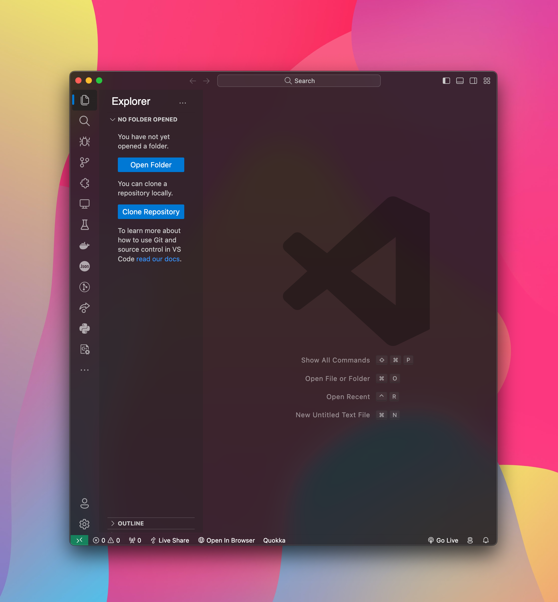
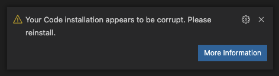
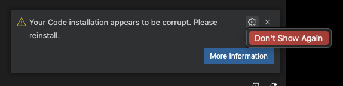

# Glassmorphism MacOS Extension for Visual Studio Code

## Overview

Bring the stunning Acrylic/Glass effect to your Visual Studio Code with Glassmorphism MacOS. Experience a sleek, macOS-inspired interface right in your editor.

### Quick Links

- [FAQs](#FAQs)
- [GitHub Repository](https://github.com/krautgti/glass-theme-doyle)
- [Visual Studio Code Marketplace](https://marketplace.visualstudio.com/items?itemName=krautgti.glass-theme-doyle)
- [Report Issues](https://github.com/krautgti/glass-theme-doyle/issues)

### Badges

## Important Notice

### VSCode Corruption Warning

Upon installation, you might see a warning about VS Code being "corrupt." This is due to the extension modifying VS Code's CSS file. You can safely dismiss this warning and prevent it from reappearing.

For removing the "[Unsupported]" title bar warning, use [Fix VSCode Checksums](https://marketplace.visualstudio.com/items?itemName=lehni.vscode-fix-checksums).

## Supported Operating Systems

- Windows 11
- Windows 10
- macOS

## Getting Started

1. Ensure your VSCode theme is 'Dark+' or a [supported theme](#vscode_vibrancy.theme).
2. Install Glassmorphism MacOS from the [VS Code Marketplace](https://marketplace.visualstudio.com/items?itemName=krautgti.glass-theme-doyle).
3. Activate the "Reload Vibrancy" command (Press F1).
4. Restart VSCode when prompted.

Remember to re-enable Vibrancy after every VS Code update.

## Configuration Options

- **vscode_vibrancy.type**: Choose the Vibrancy Effect type (auto, acrylic, appearance-based, etc.).
- **vscode_vibrancy.opacity**: Set the opacity level (-1.0 to 1.0).
- **vscode_vibrancy.imports**: Import custom CSS/JS files.
- **vscode_vibrancy.preventFlash**: Toggle new method to prevent window flashing (default: true).
- **vscode_vibrancy.refreshInterval**: Set refresh interval for transparency update (1 to 1000 ms).

## Vibrancy Themes

Select from a variety of Vibrancy themes, including Default Dark, Tokyo Night Storm, Solarized Dark+, and more.

Contribute or explore more themes [here](https://github.com/krautgti/glass-theme-doyle/tree/master/themes).

## FAQs

- **Uninstalling**: Use "Disable Vibrancy" command and restart VS Code.
- **Terminal Issues**: Change the terminal renderer type to dom.
- **Administrator Privileges Prompt**: Restart VS Code as an administrator.
- **EROFS Error on macOS**: Move VS Code to `/Applications` or use the provided terminal command.
- **Windows 10 Lag Issues**: Read the [discussion](https://github.com/EYHN/vscode-vibrancy/discussions/80).
- **Effect Not Working**: Ensure transparency effects are enabled in your OS settings.
